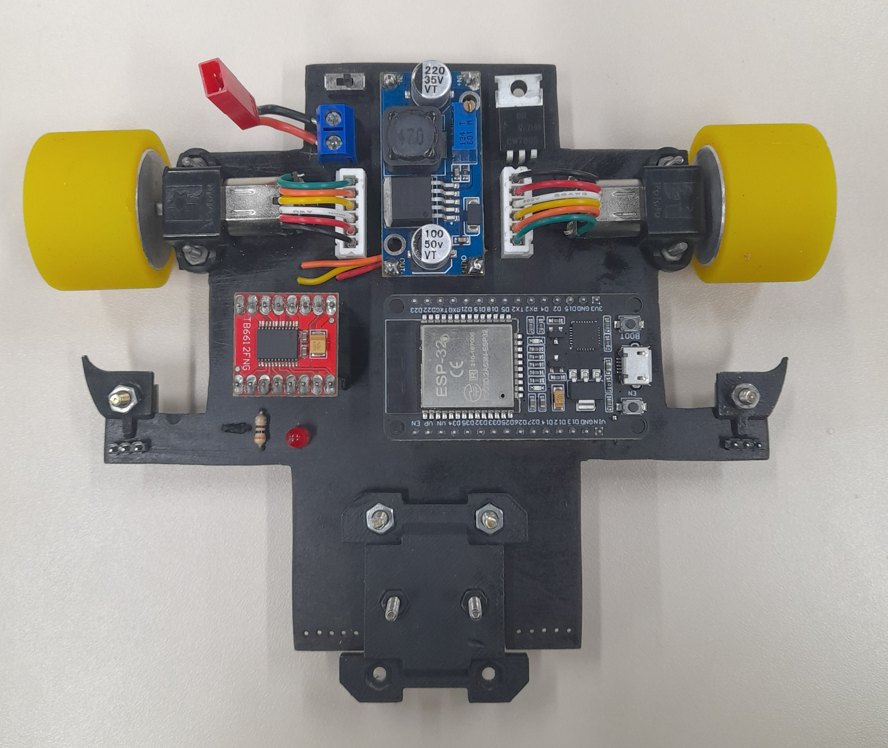
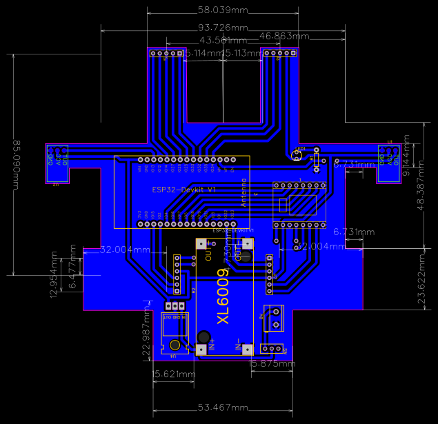
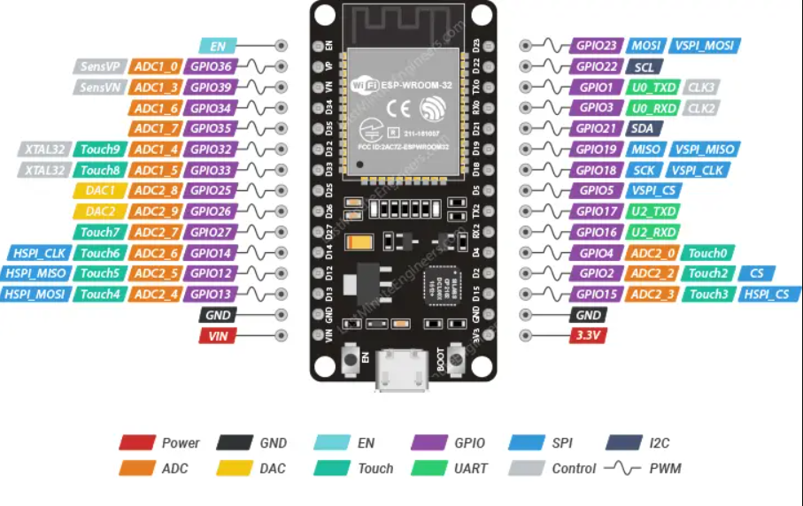

# NOVO ROBÔ - GERM/UDESC

[](https://github.com/seu-usuario/seu-repositorio)

Este projeto foi desenvolvido por um grupo de estudantes de engenharia elétrica e ciência da computação da UDESC, com o objetivo de criar um robô seguidor de linha de alta performance utilizando controle PID e componentes de ponta.



## Tabela de Conteúdos
- [Visão Geral](#visão-geral)
- [Hardware Utilizado](#hardware-utilizado)
- [Esquema Elétrico e Pinagem](#esquema-elétrico-e-pinagem)
  - [Pinagem do ESP32](#pinagem-do-esp32)
  - [Diagrama de Conexões](#diagrama-de-conexões)
- [Estrutura do Projeto](#estrutura-do-projeto)
- [Software e Controle](#software-e-controle)
  - [Controle PID](#controle-pid)
  - [Ajuste Fino do PID](#ajuste-fino-do-pid)
- [Como Compilar e Usar](#como-compilar-e-usar)
- [Roadmap e Melhorias Futuras](#roadmap-e-melhorias-futuras)
- [Licença](#licença)

## Visão Geral

O robô seguidor de linha HERMES foi projetado para detectar e seguir pistas com alta precisão e velocidade. Ele utiliza um array de sensores de reflectância para monitorar a linha e ajustar dinamicamente sua posição, garantindo um movimento eficiente e rápido. O controle é realizado por um microcontrolador ESP32, que processa os dados dos sensores e comanda os motores através de uma ponte H.

## Hardware Utilizado

| Componente | Descrição / Modelo |
| :--- | :--- |
| **Microcontrolador** | ESP32-WROOM-32 |
| **Sensores de Linha** | Oito sensores QRE da ROBOCORE|
| **Sensores Laterais** | Dois sensores QRE da ROBOCORE |
| **Driver de Motor** | Ponte H **TB6612FNG** |
| **Motores** | Motores Pololu N20 10.000 RPM com caixa de redução 1:10 |
| **Encoders** | Encoders magnéticos Pololu para motores N20 |
| **Conversor de Tensão**| Módulo Step-Up XL6009 |
| **Bateria** | LiPo 2S (7.4V) |

## Esquema Elétrico e Pinagem

Abaixo detalhamos a pinagem utilizada e as principais conexões de alimentação, o esquema foi feito usando EasyEDA.



### Pinagem do ESP32



Esta tabela descreve a conexão de cada periférico aos pinos do ESP32.

| Função | Pino do ESP32 | Descrição |
| :--- | :---: | :--- |
| **Driver Motor A (Direita)** | | |
| `PWMA` | `GPIO 4` | Sinal PWM para controle de velocidade do Motor A |
| `AIN1` | `GPIO 16` | Controle de direção 1 do Motor A |
| `AIN2` | `GPIO 17` | Controle de direção 2 do Motor A |
| **Driver Motor B (Esquerda)**| | |
| `PWMB` | `GPIO 21` | Sinal PWM para controle de velocidade do Motor B |
| `BIN1` | `GPIO 18` | Controle de direção 1 do Motor B |
| `BIN2` | `GPIO 19` | Controle de direção 2 do Motor B |
| **Controle do Driver** | | |
| `STBY` | `GPIO 5` | Habilita/Desabilita o driver TB6612FNG (Standby) |
| **Sensores de Linha** | | |
| `QTR-8RC (Dados)` | `GPIO 23, 22, ...` | *[DEFINIR OS PINOS DE DADOS DOS 8 SENSORES]* |
| `QTR-8RC (LEDON)` | `GPIO 25` | *[EXEMPLO] Controle dos emissores IR* |
| **Sensores Laterais** | | |
| `Sensor Direito` | `GPIO 32` | *[EXEMPLO]* |
| `Sensor Esquerdo`| `GPIO 33` | *[EXEMPLO]* |
| **Encoders** | | |
| `Encoder A` | `GPIO 34, 35` | *[EXEMPLO - Apenas pinos de entrada]* |
| `Encoder B` | `GPIO 36, 39` | *[EXEMPLO - Apenas pinos de entrada]* |


### Diagrama de Conexões

> **[INSIRA AQUI UMA IMAGEM DO DIAGRAMA ELÉTRICO (FEITO EM KICAD, FRITZING, ETC.)]**

**Pontos Críticos de Alimentação:**
-   **Alimentação dos Motores (`VM`):** O pino `VM` do driver TB6612FNG deve ser conectado diretamente à saída da bateria (ou do conversor Step-Up). **Nunca** alimente os motores com os 5V do ESP32.
-   **Alimentação da Lógica (`VCC`):** O pino `VCC` do driver deve ser conectado ao pino **3.3V** do ESP32.
-   **GND Comum:** É **essencial** que o pino `GND` da bateria, o `GND` do driver e o `GND` do ESP32 estejam todos conectados juntos. A falta de um GND comum é a principal causa de comportamento instável.

## Estrutura do Projeto

A organização dos arquivos segue o padrão da plataforma Arduino/PlatformIO para facilitar a manutenção.

```
HERMES/
├── src/                      # Pasta principal com o código-fonte (.ino ou .cpp)
│   └── HERMES.ino
├── lib/                      # Bibliotecas externas (ex: PID, QTRSensors)
│   ├── PID/
│   └── QTRSensors/
├── doc/                      # Documentação adicional e arquivos de design
│   └── schematic.pdf
├── media/                    # Imagens e vídeos para o README
│   └── photo_robocore2025.jpg
└── README.md                 # Este arquivo
```

## Software e Controle

O cérebro do robô é um algoritmo de controle PID (Proporcional, Integral e Derivativo) que ajusta a velocidade dos motores com base nos dados dos sensores de linha. Isso garante que o robô permaneça estável na pista, corrigindo sua posição em tempo real. Para o controle PWM, utilizamos o periférico `LEDC` nativo do ESP32, que oferece maior precisão e flexibilidade do que a função `analogWrite` padrão do Arduino.

### Controle PID
- **Termo Proporcional (P):** Corrige o erro atual. É a resposta principal do robô à sua distância da linha.
- **Termo Derivativo (D):** Amortece a resposta, prevendo o erro futuro. Ajuda a evitar oscilações.
- **Termo Integral (I):** Corrige erros acumulados ao longo do tempo, como desvios sistemáticos em longas retas.

### Ajuste Fino do PID
A calibração das constantes `Kp`, `Ki` e `Kd` é essencial para a performance.
1.  **Ajuste Kp:** Zere `Ki` e `Kd`. Aumente `Kp` até que o robô comece a oscilar de forma consistente ao redor da linha.
2.  **Ajuste Kd:** Mantenha `Kp`. Aumente `Kd` gradualmente para reduzir as oscilações e suavizar o movimento.
3.  **Ajuste Ki:** Se o robô tiver um desvio constante em certas partes da pista, adicione um valor pequeno de `Ki` para corrigir esse erro acumulado.

## Como Compilar e Usar

**Pré-requisitos:**
1.  [Arduino IDE](https://www.arduino.cc/en/software) ou [PlatformIO](https://platformio.org/) instalado.
2.  Suporte para placas ESP32 instalado no seu ambiente de desenvolvimento.

**Passos:**
1.  Clone este repositório: `git clone https://github.com/seu-usuario/seu-repositorio.git`
2.  Abra o projeto na sua IDE.
3.  Instale as bibliotecas necessárias localizadas na pasta `lib/` ou através do Gerenciador de Bibliotecas.
4.  Conecte o ESP32 ao seu computador via USB.
5.  Selecione a placa correta (ex: "ESP32 Dev Module") e a porta COM.
6.  Compile e carregue o código.
7.  Abra o Monitor Serial com baud rate de `115200` para ver os logs de debug.

## Roadmap e Melhorias Futuras

-   [ ] **Modularizar Sensores Frontais:** Substituir o array Pololu por 8 sensores de reflectância QRE da Robocore montados em uma PCB customizada para melhor posicionamento e manutenção.
-   [ ] **Testar Novos Pneus:** Avaliar o desempenho dos pneus de silicone `StickyMAX S20` para aumentar a aderência em curvas.
-   [ ] **Integrar Encoders na PCB:** Anexar os encoders diretamente na placa principal para eliminar a fiação solta e melhorar a robustez do sistema.
-   [ ] **Upgrade do ESP32:** Pesquisar e adquirir um modelo de ESP32 com conectividade sem fio (Bluetooth/BLE) mais robusta para telemetria e controle em ambientes de competição.
-   [ ] **Otimização da Bateria:** Trocar a bateria atual por uma de menor peso e maior eficiência (ex: 300-500mAh), seguindo o padrão de equipes de ponta.
-   [ ] **Melhorar Conexão da Bateria:** Redesenhar o suporte ou a conexão da bateria para evitar interferência mecânica com as rodas.

## Licença

Este projeto está licenciado sob a Licença MIT.
